# GIMLab GitHub Organization Onboarding

This is an onboarding tutorial that contains two parts:

1. [How to create a new repository in the Lab's GitHub Organization](#create-new-repository-within-organization)
2. How to upload codes into the created repository
   - [Using Windows](#windows)
   - [Using macOS](#macos)

*The tutorial contains only basic-level introductions on the `init`, `pull`, `commit`, and `push` features. If you have worked with GitHub and GitHub Organization before, please feel free to skip this.*

**Before we start, please make sure you have accepted the invitation to join the GitHub Organization. Check the email that you registered GitHub with for the invitation link.**

----

## Create New Repository Within Organization

1. Click the "**+**" sign on the upper-right side of your GitHub page. Then click "**New repository**".

   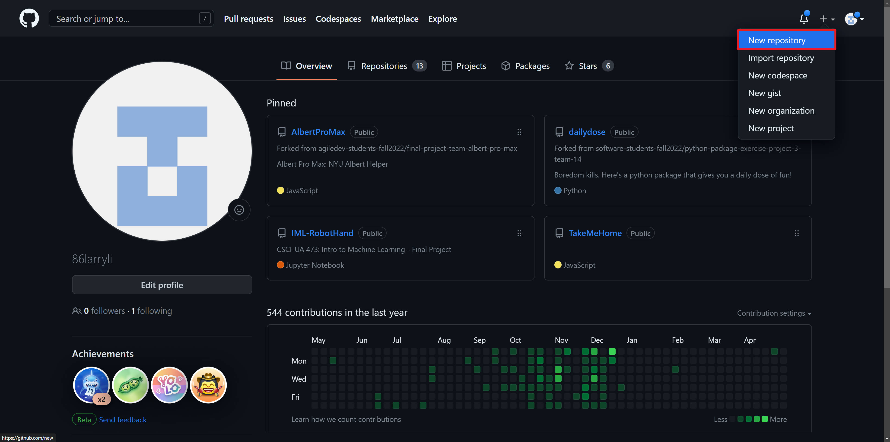

2. Change the owner of your repository to "**GIMLabHur**".

   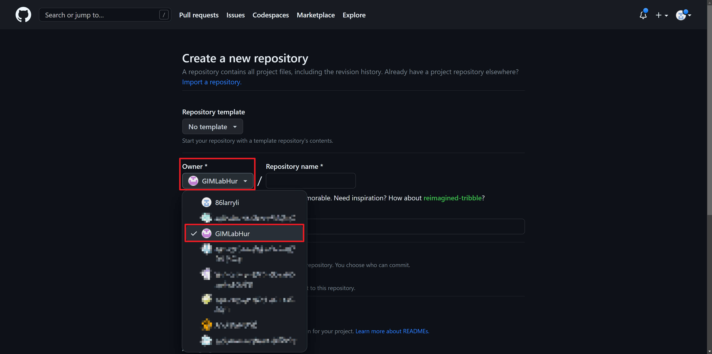

3. Set the name of your repository (feel free to be creative) :D

   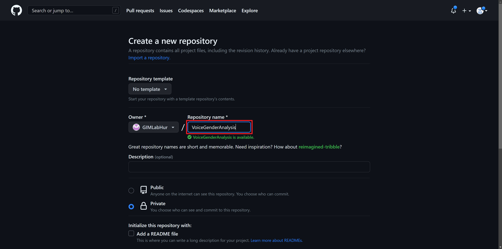

4. Set the visibility of your repository. It is **highly recommended** that you set the visibility to "**Private**".

   - **Private** visibility means that you and other Lab members can see the content of your repository.
   - **Public** visibility means that everyone with your repository link can see the content of your repository.

   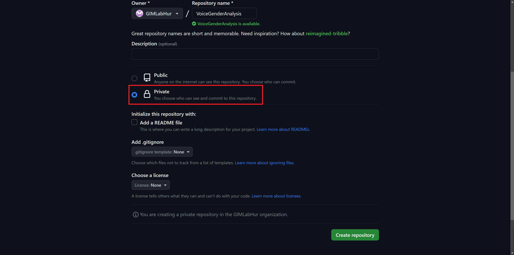

5. Choose if you want to add a README file. It is **highly recommended** that you include a README file in your repository.

   A README is often the first item a visitor will see when visiting your repository. README files typically include information on the following:
   - What the project does?
   - How others can get started with the project (typically, what do they need to install? what steps do they need to follow?)

	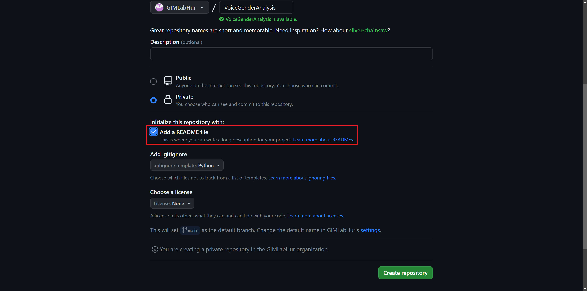

6. Choose if you want to add a `.gitignore` file. It is **highly recommended** that you include a `.gitignore` file in your repository.

   A `.gitignore` file prevents uploading unwanted temporary or trash files into your repository. These files are generated for all sorts of reasons, such as by your programming language, code editor, or operating system.

   You can select the template based on your programming language, for example, if your code is in Python or if you're uploading a Jupyter Notebook, you should select Python. If your code is in R, you should select R. If none of the options matches your case, you can select None and upload one later manually.

   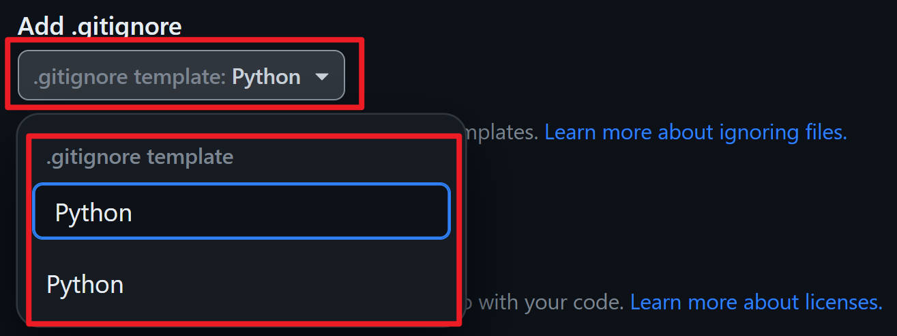

7. Finally, click "Create repository" at the bottom. And you will be redirected to your repository page.

   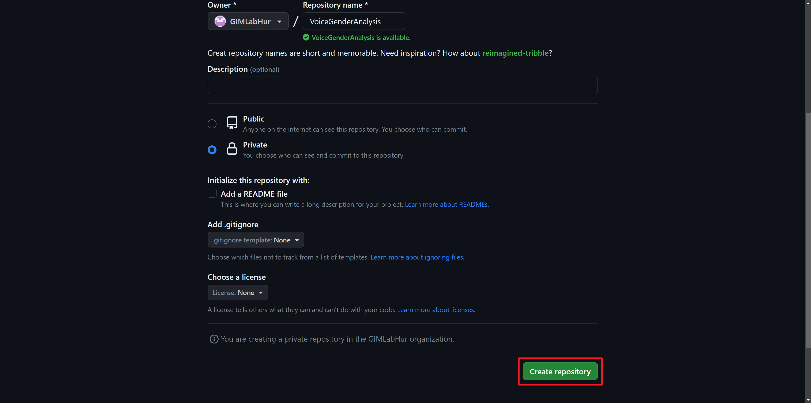

----

## Uploading Codes to the Repository

We will now go over how to upload codes to the previously created repository.

### Windows

If you are using the Windows operating system, follow the steps below:

1. Open the folder that contains the code you want to upload, and copy the folder path.

   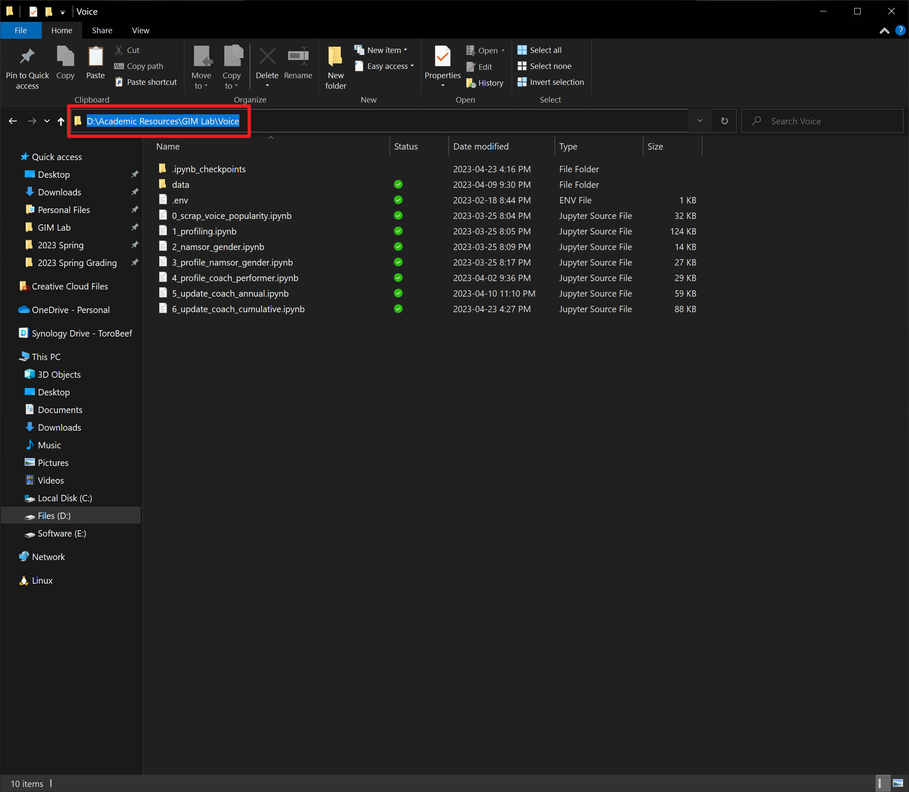

2. Open Command Prompt (`cmd`).

   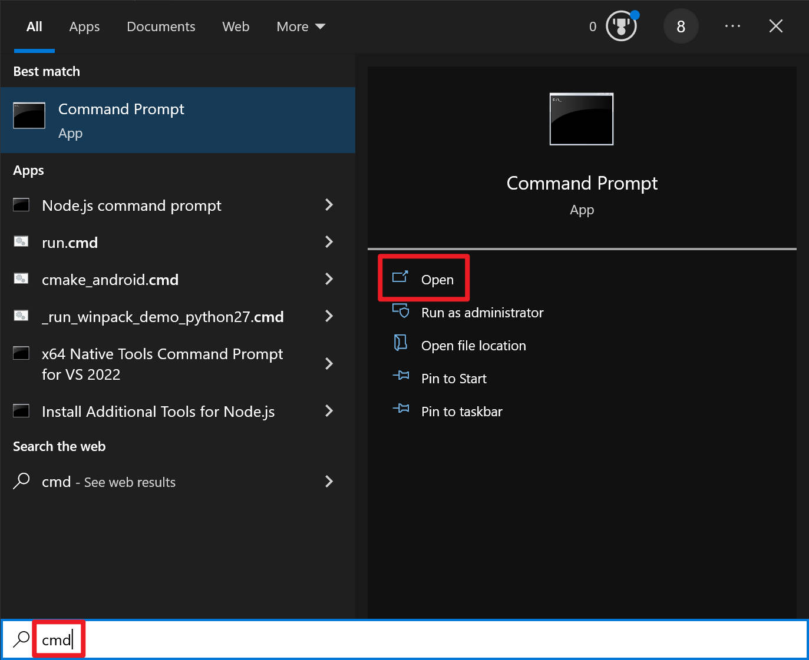

3. Change the working directory by typing `cd PASTE_YOUR_FOLDER_PATH_IN_STEP_1` and `<ENTER>`. For example, `cd D:\Academic Resources\GIM Lab\Voice`.

   Note that there is a `<SPACE>` between `cd` and your folder path.

   After pressing `<ENTER>` you should see the path being changed to the folder path in Step 1 as shown in red.

   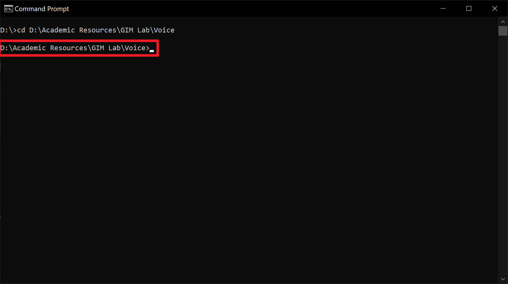

4. Initialize the Git repository by typing `git init` and `<ENTER>`.

   If successful, you should see a message saying, "Initialized empty Git repository in ..."

   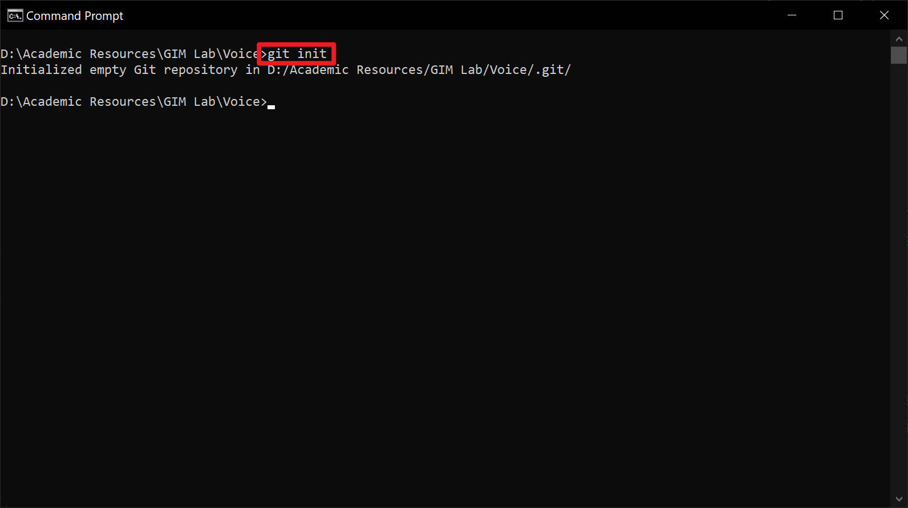

5. Change the working branch name to `main` by typing `git branch -M main` and `<ENTER>`.

   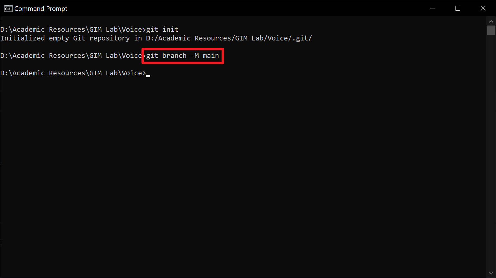

6. First, go to your repository page, and click on the green "**Code**" button. Then, click on the copy button (shown in red) that copies the Git URL to your repository.

   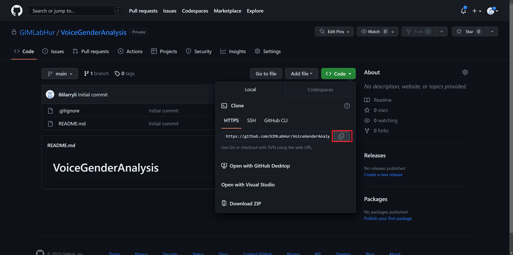

   Next, add the remote by typing `git remote add origin <GIT_URL_YOU_JUST_COPIED>` and `<ENTER>`.

   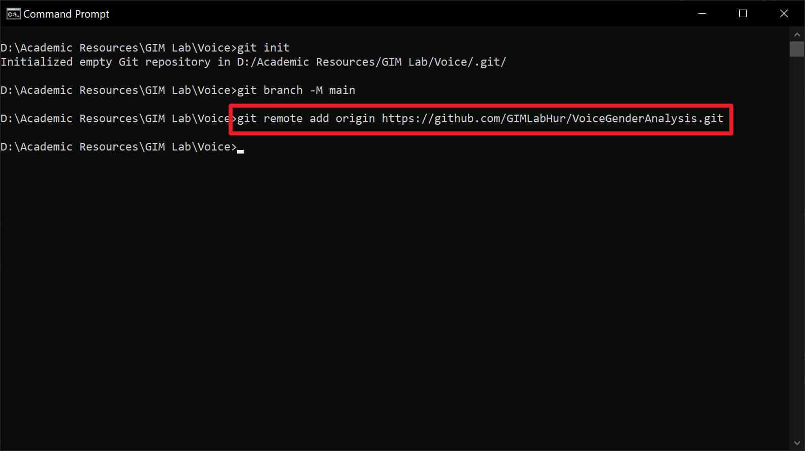

7. Download (pull) the `README` file and `.gitignore` file by typing `git pull origin main` and `<ENTER>`.

   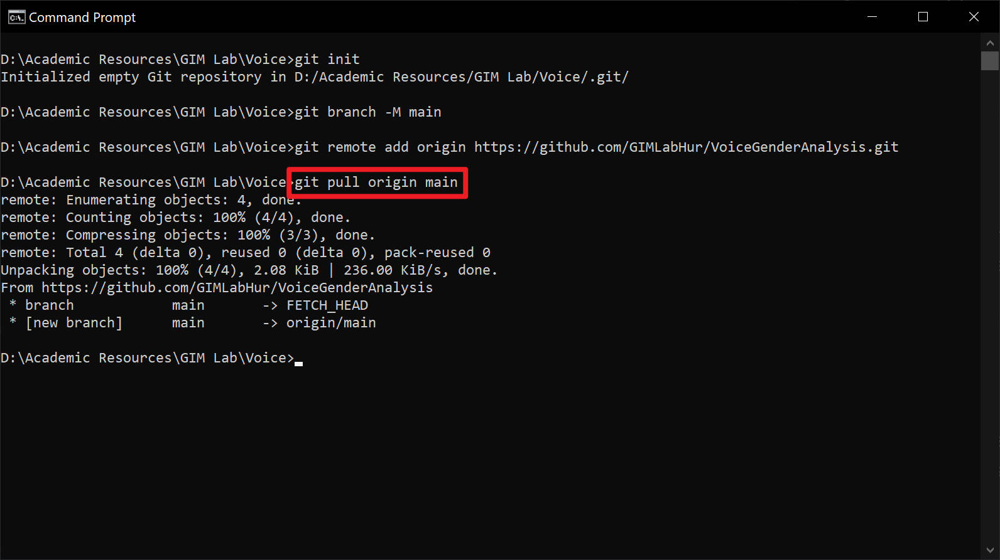

8. Add what file you want to upload to the repository. Here, we are uploading all files within this folder and its subfolders by typing `git add --all` and `<ENTER>`.

   You will likely see some warning messages. It's okay to ignore them.

   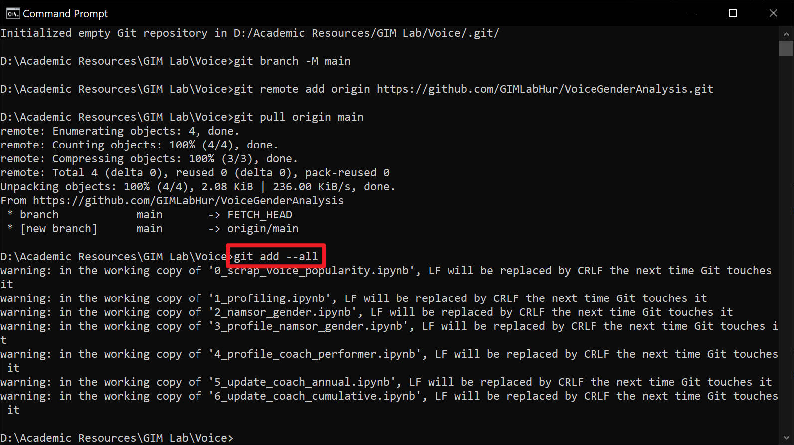

9. Add a commit message by typing `git commit -m "initial commit"` and `<ENTER>`.

   The commit message is a very short description of what is changed/uploaded in this upload. Here our commit message is ***initial commit\***, but you can also change it to something like ***add codes\*** or whatever you see fit. Make sure to put your commit message in quotation marks.

   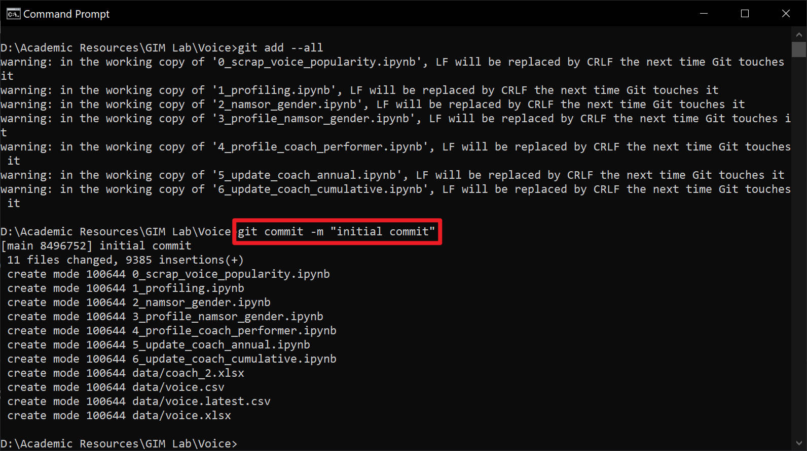

10. Upload (push) the files to your repository by typing `git push -u origin main` and `<ENTER>`.

    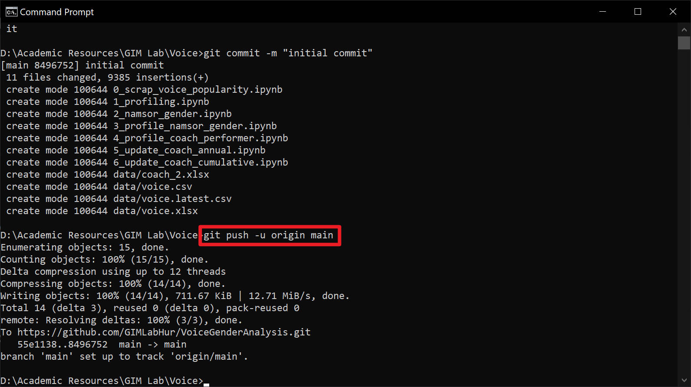

11. Congratulations! You can now go to your repository page and verify that your codes have been successfully uploaded.

    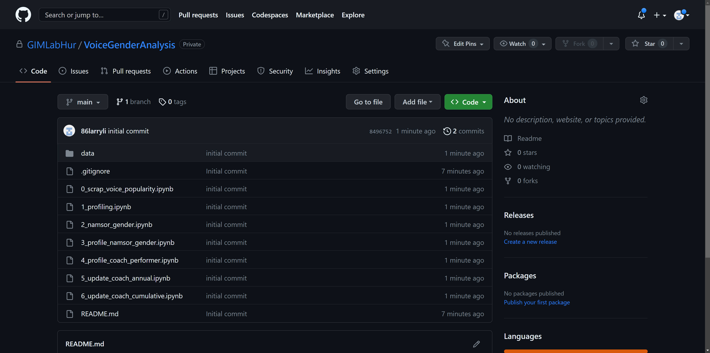

----

### macOS

If you are using the macOS operating system, follow the steps below:

1. Copy folder that contains the code you want to upload.

   

2. Open Terminal.

   

3. Change the working directory by typing `cd PASTE_YOUR_FOLDER_PATH_IN_STEP_1` and `<ENTER>`.

   Note that there is a `<SPACE>` between `cd` and your folder path.

   After pressing `<ENTER>` you should see the directory name being changed to the folder name in Step 1 as shown in red.

   

4. **Follow Step 4 to Step 11 in the [Windows Tutorial](#windows).**

----